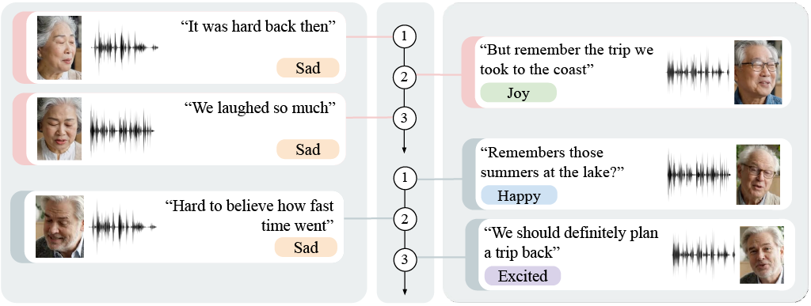

# Multimodal Emotion Recognition in Conversations via Class-Wise Adaptive Modality Fusion and Affective Geometry

Code for the paper *"Multimodal Emotion Recognition in Conversations via Class-Wise Adaptive Modality Fusion and Affective Geometry"* (ECCV 2026 submission, paper ID #24). The method extends the Self-Distillation Transformer (SDT) [Ma et al., 2024] for multimodal Emotion Recognition in Conversations (ERC) on IEMOCAP and MELD.

## Abstract
 
ERC requires integrating heterogeneous textual, audio, and visual cues while accounting for conversational context and emotional dynamics. We extend SDT with appearance+geometry visual representations, class-wise adaptive modality fusion, and a valence-arousal prior for affective transitions. On MELD and IEMOCAP, geometry-enhanced visual representations improve weighted F1 by 0.27 and 4.36 points over appearance-only features, respectively, while class-wise adaptive fusion provides further gains of 0.17 and 0.25 points over the original softmax gate. The valence-arousal prior yields targeted improvements of 0.30 and 0.74 accuracy points on emotionally shifted utterances while preserving performance on stable turns.

<p align="center">
  
</p>

## Contributions
 
1. **Appearance+geometry visual representations** — ViT appearance features combined with facial geometry descriptors (3D landmarks, expression parameters, or action units) via symmetric addition, strengthening the visual stream.
2. **Class-wise adaptive modality fusion** — replaces SDT's softmax-based multimodal gate with a fusion strategy that estimates each modality's reliability separately per emotion class, operating at the logit level.
3. **Valence-arousal prior for emotion shifts** — a post-hoc correction grounded in Russell's circumplex model, applied to the fused logits after class-wise fusion. It scales with the magnitude of the predicted affective transition (`β_i`) and favors classes close to the previous affective state (`τ_va`), controlled by a global strength parameter `α`.


## Results (weighted F1, mean over MELD + IEMOCAP)
 
| Configuration | MELD | IEMOCAP | Mean |
|---|---|---|---|
| Updated SDT baseline | 75.49 | 69.50 | 72.50 |
| + Appearance+geometry visual stream | 75.76 | 73.86 | 74.81 |
| + Class-wise adaptive modality fusion | **75.93** | **74.11** | **75.02** |
 
The valence-arousal prior is evaluated separately on emotion-shift subsets (see paper Table 4): it improves shift-utterance accuracy by 0.30 points on MELD and 0.74 points on IEMOCAP, while leaving stable-utterance accuracy essentially unchanged.
 
 ## Repository structure
 
```
.
├── multimodal/           # SDT-based model: dataloader, model, training, inference
│   ├── dataloader.py
│   ├── model.py
│   ├── train.py
│   └── inference.py
├── unimodal/              # Per-modality embedding extraction
│   ├── text/              # RoBERTa-large (sentence-transformers, all-roberta-large-v1)
│   ├── audio/              # emotion2vec_plus_large + degradation protocol
│   └── visual/             # ViT + 3D landmarks / expression params / action units + active speaker detection
├── LICENSE
└── README.md
```

See [`multimodal/README.md`](multimodal/README.md) and [`unimodal/README.md`](unimodal/README.md) for details on each stage.

## Datasets
 
Experiments use **MELD** (7-class, multi-party, 13,708 utterances, official train/val/test splits) and **IEMOCAP** (6-class, dyadic, 7,433 utterances, sessions 1-4 train / session 5 test). Neither dataset is redistributed here — obtain them from their original sources under their respective licenses and set the paths expected by `unimodal/*/main.py` and `multimodal/dataloader.py`. IEMOCAP's continuous valence-arousal annotations are used to derive dataset-specific class centroids for the valence-arousal prior; MELD uses canonical Russell circumplex coordinates instead, as it has no continuous annotations.

## Setup
 
Two environments are needed:
 
```bash
# main environment (unimodal extraction except action units, and multimodal training/inference)
conda env create -f environment.yml
conda activate sdt_env
 
# separate environment for action-unit extraction (py-feat)
conda env create -f environment_au.yml
conda activate au_env
```
 
> Add your `environment.yml` / `environment_au.yml` (or `requirements.txt`) alongside this README before publishing; none is committed yet.

## Pipeline
 
1. **Extract unimodal features** for text, audio, and visual streams — see [`unimodal/README.md`](unimodal/README.md).
2. **Train / evaluate the multimodal model** on top of the extracted features — see [`multimodal/README.md`](multimodal/README.md).